# Product discovery

Pré-requisitos: <a href="01-Contexto.md"> Documentação de contexto</a>

✅ [Documentação de Design Thinking (MIRO)](files/designThinking.pdf)

## Etapa de entendimento

* **Matriz CSD**: Visando organizar as informações e o alinhamento dos membros da equipe. Declaramos nossas certezas, todas nossas informações que eram seguras e confiáveis; as suposições, tudo aqui que pode vim a ser verdade em um ponto e no momento não é uma certeza; e as dúvidas, pontos de lacunas ainda não respondidas.

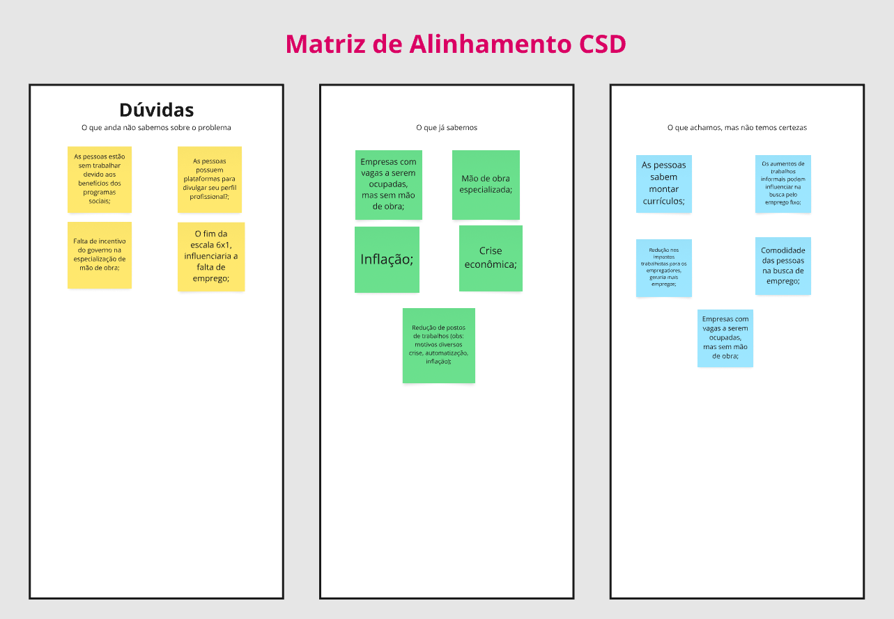

* **Mapa de stakeholders**: É essencial para garantir que as decisões irão ser tomadas levando em consideração todos que podem influenciar ou ser impactados pela solução desenvolvida. Sendo pessoas, grupos ou organizações que têm algum tipo de interesse, envolvimento ou influência sobre o projeto.

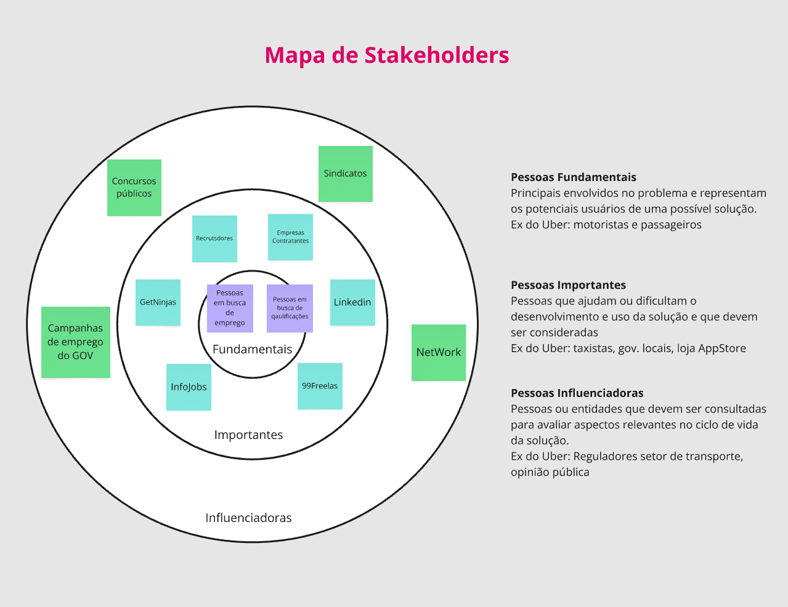

* **Entrevistas qualitativas**: Técnica de coleta de dados utilizada para compreender percepções, sentimentos, motivações e experiências das pessoas em profundidade. Algumas das entrevistas realizadas: 

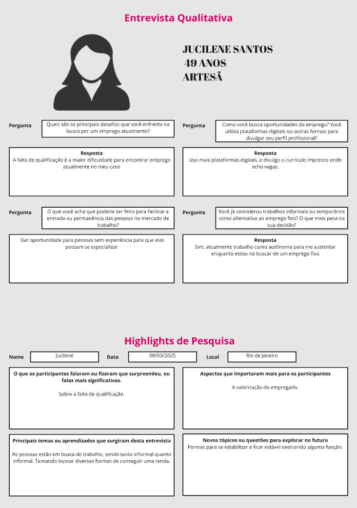
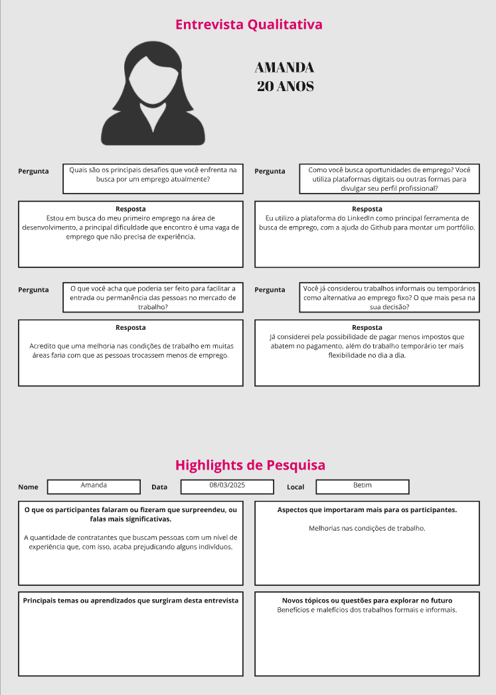
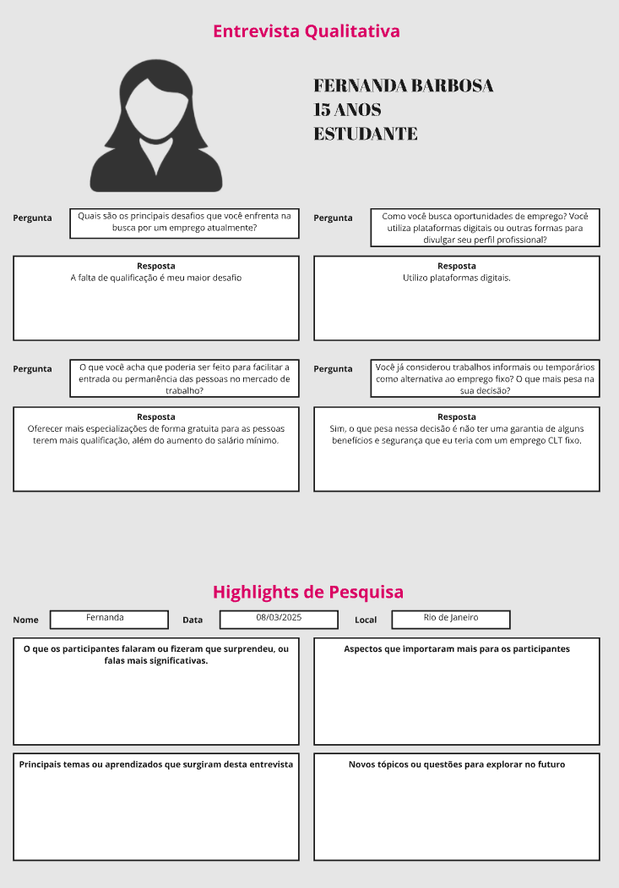
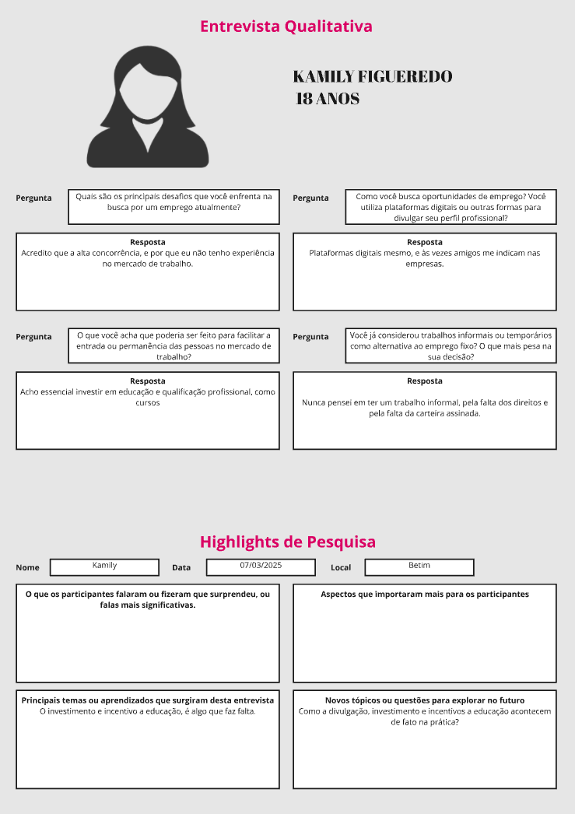
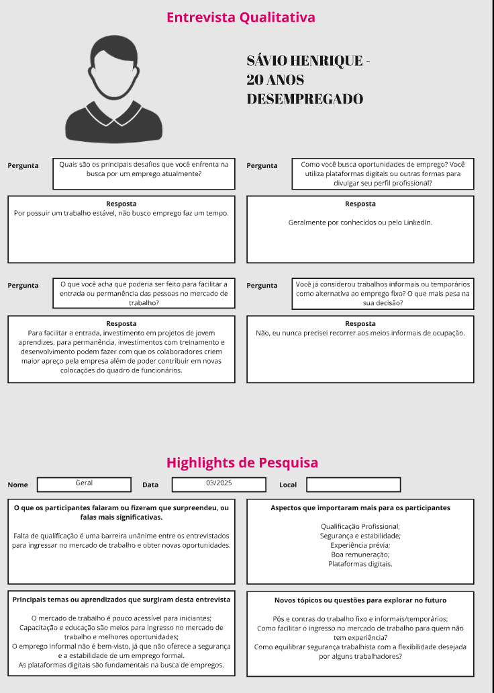

* **Highlights de pesquisa**:  Resumo das descobertas mais relevantes, extraídas diretamente dos dados coletados nas entrevistas.

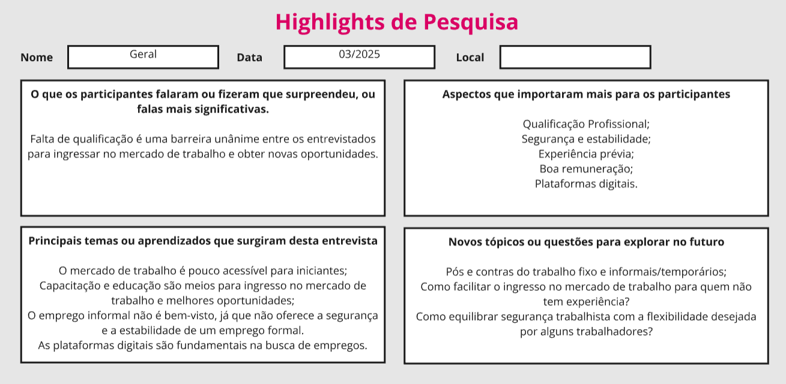

## Etapa de definição

### Personas

Personas são personagens fictícios, criados com base em dados reais de pesquisa, que representam os diferentes perfis de usuários ou públicos-alvo do projeto.

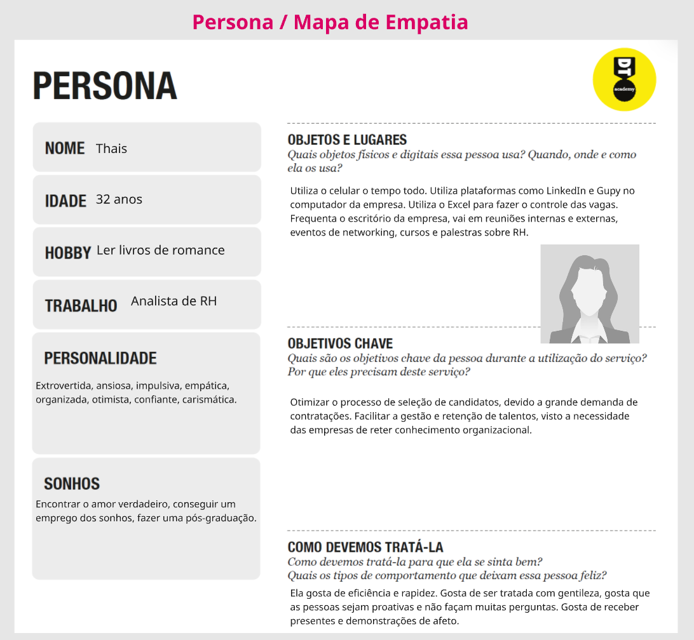
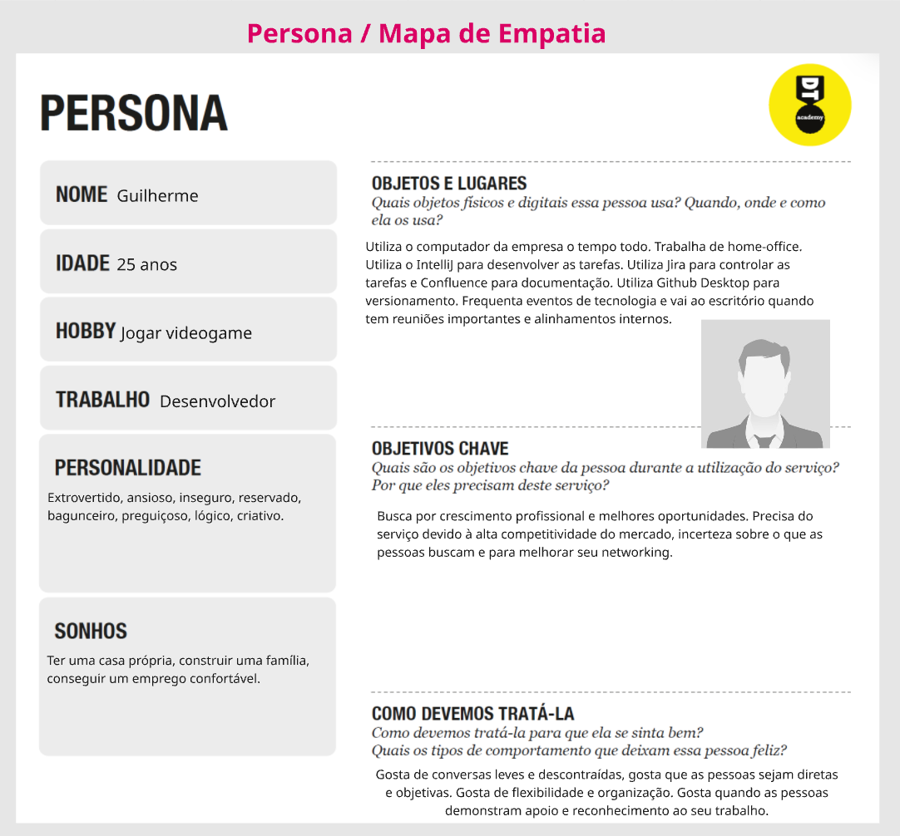
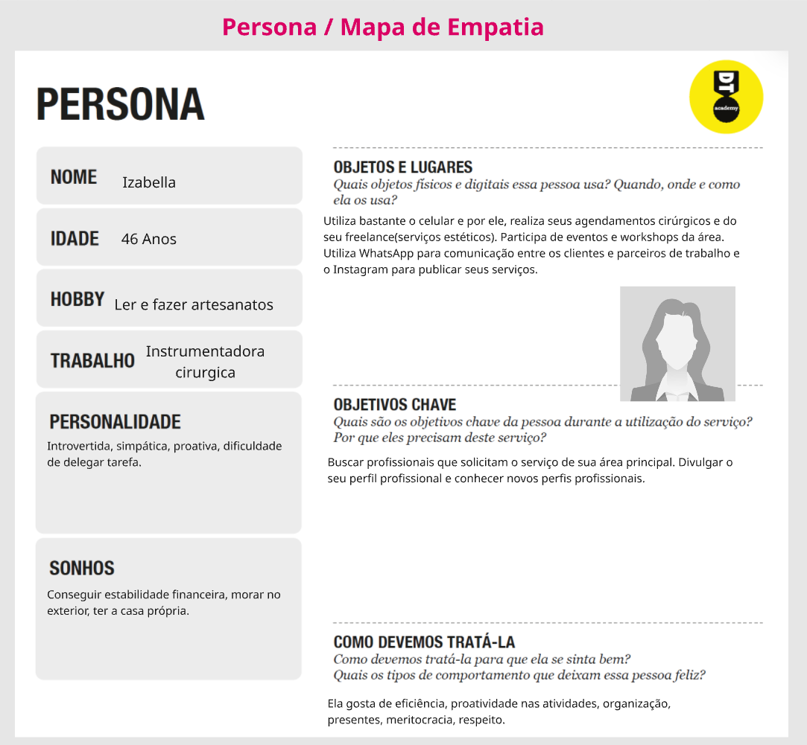
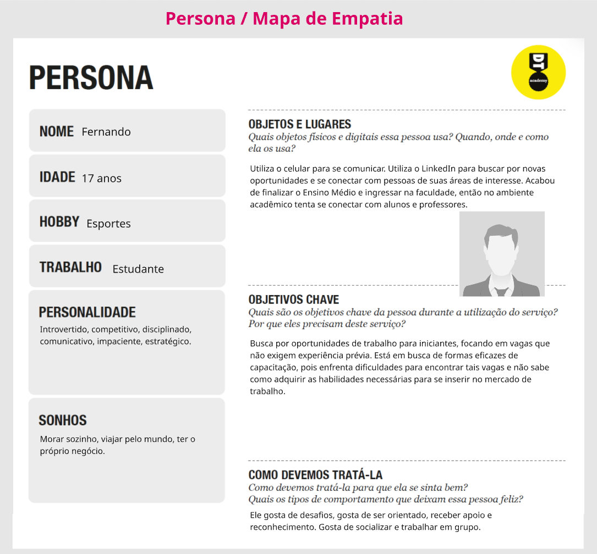

