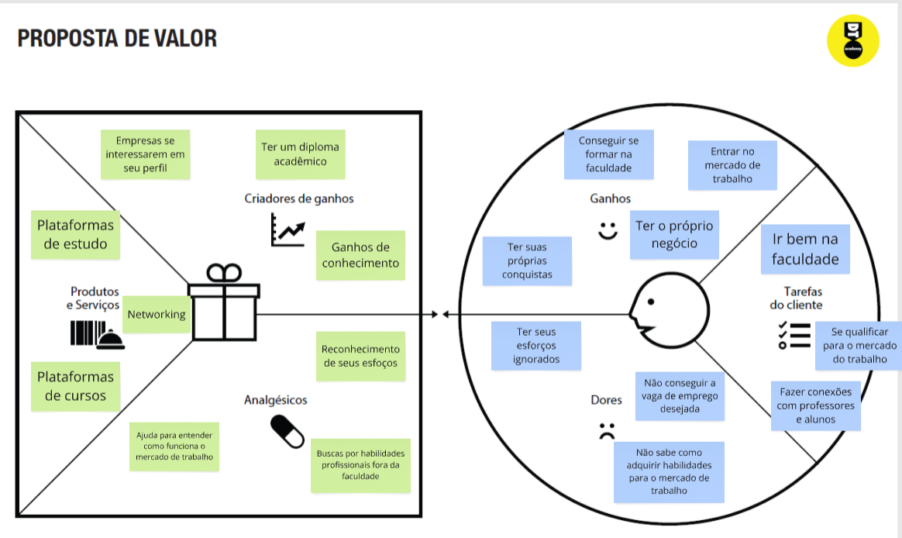
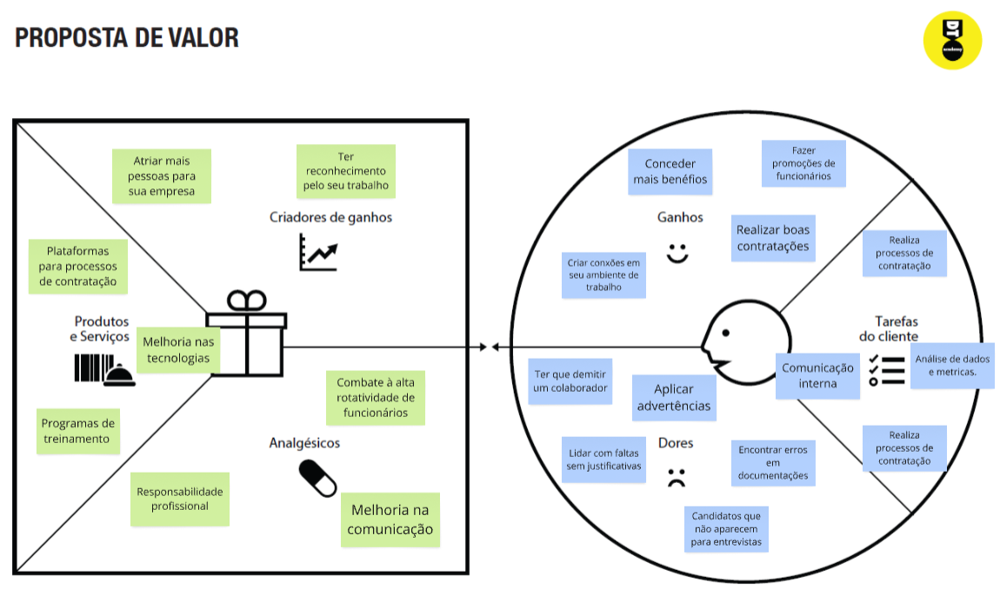
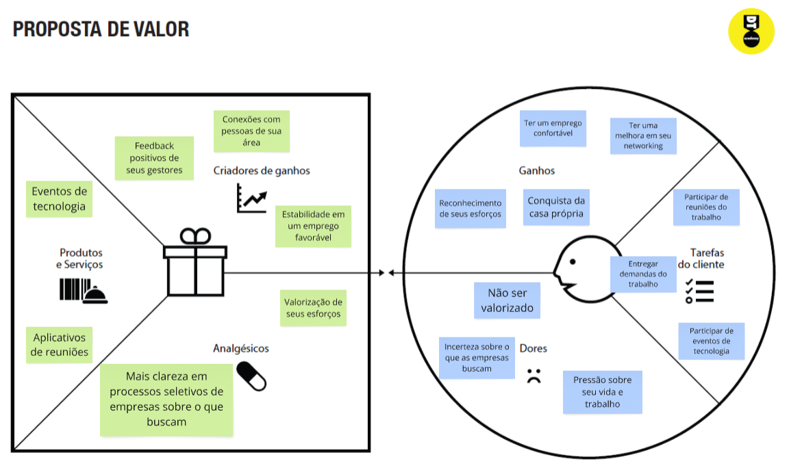
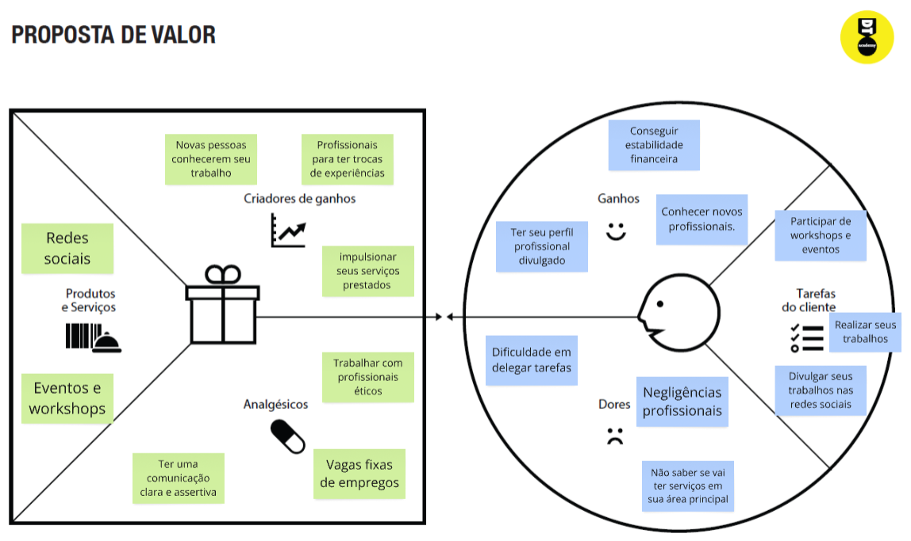

# Product design

Pré-requisitos: <a href="02-Product-discovery.md"> Product discovery</a>

## Histórias de usuários

Com base na análise das personas, foram identificadas as seguintes histórias de usuários:

|EU COMO... `PERSONA`| QUERO/PRECISO ... `FUNCIONALIDADE` |PARA ... `MOTIVO/VALOR`                 |
|--------------------|------------------------------------|----------------------------------------|
|Usuário do sistema  | cadastrar no sistema | eu possa fazer a criação da minha conta no site|
|Usuário do sistema | fazer login  |  que eu possa acessar os dados da minha conta |
|Usuário do sistema | ver os cursos disponíveis na minha área  | que eu possa acessá-los e conhecer para realizá-los |
|Usuário do sistema |quero incluir informações no meu currículo | que eu possa especificar meus dados e montar meu currículo com base nas minhas habilidades desenvolvidas e requisitos da vaga |
|Usuário do sistema |editar os dados inseridos no meu currículo | que eu possa modificar ou acrescentar informações |
|Usuário do sistema |excluir meu currículo |que eu possa começar outro do zero |
|Usuário do sistema |gerar meu currículo depois de pronto |  que eu possa imprimir ou salvar como pdf |
|Usuário do sistema |acessar as dicas disponíveis |que eu possa me preparar melhor para uma entrevista de emprego |
|Administrador do sistema |poder adicionar mais cursos na aba de cursos |que possa ter um painel mais completo para os usuários |

## Proposta de valor

APRESENTAÇÃO DO DIAGRAMA DA PROPOSTA DE VALOR PARA CADA PERSONA

## Requisitos

As tabelas a seguir apresentam os requisitos funcionais e não funcionais que detalham o escopo do projeto.

### Requisitos funcionais

| ID     | Descrição do Requisito                                     | Prioridade |
| ------ | ---------------------------------------------------------  | ---------- |
| RF-001 | O sistema deve permitir a criação de contas                |  ALTA      |
| RF-002 | O sistema deve permitir realizar login em sua conta        |  ALTA      |
| RF-003 | O sistema deve permitir navegar nos cursos disponíveis     |  ALTA      |
| RF-004 | O sistema deve permitir gerar um currículo                 |  ALTA      |
| RF-005 | O sistema deve permitir incluir informações do currículo   |  ALTA      |
| RF-006 | O sistema deve permitir editar as informações do currículo |  MÉDIA     |
| RF-007 | O sistema deve permitir favoritar os cursos                |  ALTA      |
| RF-008 | O sistema deve permitir o usuário a visualizar os favoritos|  MÉDIA     |
| RF-009 | O sistema deve permitir pesquisar cursos por nome          |  BAIXA     |
| RF-010 | O sistema deve permitir avaliar o site                     |  BAIXA     |
| RF-011 | O sistema deve permitir fazer comentários no fórum         |  MÉDIA     |
| RF-012 | O sistema deve permitir dar like e deslike nos comentários |  MÉDIA     |
| RF-013 | O sistema deve permitir remover curso dos favoritos        |  MÉDIA     |

### Requisitos não funcionais

| ID      | Descrição do Requisito                                                              | Prioridade |
| ------- | ------------------------------------------------------------------------------------- | ---------- |
| RNF-001 | O sistema deve funcionar em diferentes dispositivos | MÉDIA     |
| RNF-002 | O sistema deve funcionar durante 24 horas           | BAIXA      |
| RNF-003 | O sistema deve suportar o acesso de até 1.000 usuários simultâneos | BAIXA      |
| RNF-004 | O sistema deve gerar o currículo em até 30 segundos | BAIXA     |

## Restrições

O projeto está restrito aos itens apresentados na tabela a seguir.

|ID| Restrição                                             |
|--|-------------------------------------------------------|
|001| O projeto deverá ser entregue até o final do semestre  |
|002| Não é permitido o desenvolvimento de um módulo de back-end   |
|003| Não é permitido o desenvolvimento de um banco de dados  |
