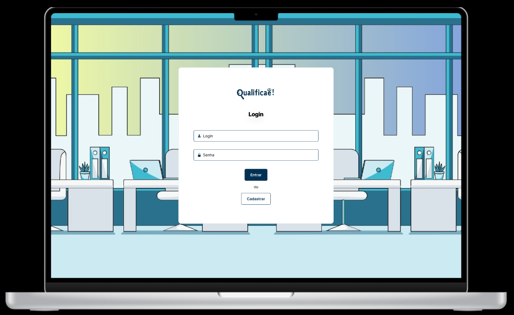

# Projeto de interface

Pré-requisitos: <a href="03-Product-design.md"> product design</a>

 Visão geral da interação do usuário pelas telas do sistema e protótipo interativo das telas com as funcionalidades que fazem parte do sistema (wireframes).

 Apresente as principais interfaces da plataforma. Discuta como ela foi elaborada de forma a atender os requisitos funcionais, não funcionais e histórias de usuário abordados na parte de <a href="03-Product-design.md"> product design</a>.

 ## User flow

## Wireframes

##### TELA PRINCIPAL

Descrição: Homepage do site onde o usuário terá a visão geral do site e a partir dela acesso as outras funcionalidades.

##### TELA LOGIN

Descrição: Login onde se usuário que já tiver login poderá entrar em sua conta ou efetuar seu cadastro.

##### TELA CADASTRO

Descrição: Cadastro dos dados para o usuário criar e ter acesso ao login.

##### TELA SOBRE NÓS

Descrição: Sobre nós traz uma visão geral de quem somos e nossa motivação com a aplicação.

##### TELA COMO FUNCIONA

Descrição: Mesmo sendo um site bem intuitivo quisemos trazer essa aba com obejetivo de explicar e tirar possíveis dúvidas de como usar o site.

##### TELA DICAS

Descrição: Em dicas o usuário vai encontrar uma série de dicas de como se comportar em uma entrevista de emprego.

##### TELA CURSOS

Descrição: Aqui o usuário irá encontrar diversos cursos gratuítos e com certificados separados por áreas de interesse, ao clicar em saiba mais ele será guiado para a plataforma que fornece o curso.

##### TELA GERADOR DE CURRÍCULOS

Descrição: Para acessar o gerador de currículos é necessário que o usuário esteja cadastrado no site e feito login, assim ele poderá terminar de preencher seus dados para gerar seu currículo.

##### TELA PERFIL GERADO

Descrição: Depois de inserir todos seus dados aqui será mostrado uma previa do perfil profissional do usuário, que é dado a opção de gerar seu currículo completo por pdf com as formatações necessárias.

##### TELA EXIBIR FAVORITOS

Descrição: Na tela de favoritos exibirá os cursos favoritados pelo usuário.

##### TELA FÓRUM

Descrição: Na tela de fórum, irá mostrar uma área de interação onde o usuário poderá fazer algum comentário e avaliar com like e dislike o comentário de outro.

##### TELA AVALIAÇÃO

Descrição: Em avalição o usuário irá avaliar o site como um todo e podendo deixar comentários além das estrelas.

### Protótipo Interativo

[Protótipo interativo](https://www.figma.com/proto/CrcEJGrKcesQyPxqsZfKER/Qualificaê-?node-id=5488-3&p=f&t=x1swShgHbTfgPFGo-0&scaling=scale-down&content-scaling=fixed&page-id=5488%3A2&starting-point-node-id=5493%3A1787)  
