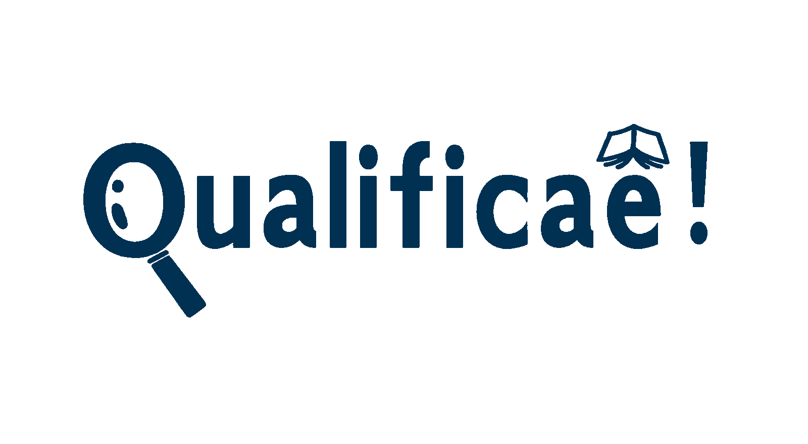

# Template padrão da aplicação

Pré-requisitos: <a href="03-Product-design.md"> Especificação do projeto</a>, <a href="04-Metodologia.md"> Metodologia</a>, <a href="05-Projeto-interface.md"> Projeto de interface</a>

### Cor
A cor azul foi escolhida como principal identidade visual do projeto Qualificaê! por seu forte simbolismo ligado ao trabalho, capacitação e mérito, exatamente os pilares que sustentam a proposta do projeto.
De acordo com a obra “A Psicologia das Cores”, de Eva Heller, o azul está diretamente associado a:

  * Fidelidade e confiança – reforçando que o projeto é um espaço seguro para quem busca crescimento profissional.
  * Inteligência e virtudes intelectuais – conectando a cor à aprendizagem, ao raciocínio lógico e ao aprimoramento de habilidades.
  * Independência, funcionalidade e mérito – refletindo o espírito de autodesenvolvimento e conquista que o Qualificaê! promove.

Além disso, a cor é utilizada em outros dois propósitos, sendo eles:
  * É a cor da carteira de trabalho brasileira, símbolo da formalização e valorização do emprego.
  * É a cor do jeans azul, tecido originalmente criado como uniforme de trabalhadores, remetendo à praticidade, resistência e dignidade do trabalho diário.

Como cor secundária, o cinza também aparece de forma sutil no projeto, reforçando a ideia de estabilidade, equilíbrio e seriedade, sem roubar o protagonismo do azul.
[Paleta de cores](https://www.pantone.com.br)

### Fonte
A fonte Inter foi escolhida por sua legibilidade, simplicidade e modernidade, ideal para interfaces digitais. Seu design limpo facilita a leitura em diferentes tamanhos e dispositivos, garantindo acessibilidade e uma comunicação visual funcional e atual.
[Fonte do site ](https://fonts.google.com/specimen/Inter)

### Nome
O nome Qualificaê! foi escolhido por ser descontraído, direto e acolhedor — um convite acessível para que as pessoas invistam em si mesmas e busquem sua qualificação profissional. A linguagem informal aproxima o projeto do público, transmitindo acolhimento e incentivo à ação.

### Elementos Visuais
Os elementos visuais da logo do Qualificaê! foram escolhidos por sua simbologia e conexão direta com os objetivos do projeto:

  * Lupa: simboliza a exploração, curiosidade e foco. Representa a busca ativa por conhecimento, novas oportunidades e colocação no mercado de trabalho — um dos principais propósitos da plataforma.
  * Livro/Caderno: representa o aprendizado, organização e construção do saber. Remetendo também ao preparo, planejamento e evolução por meio da educação e capacitação profissional.

Esses dois símbolos juntos reforçam a ideia de que o Qualificaê! é um espaço onde o usuário procura, aprende e se prepara para alcançar seus objetivos profissionais, de forma orientada e acessível.

