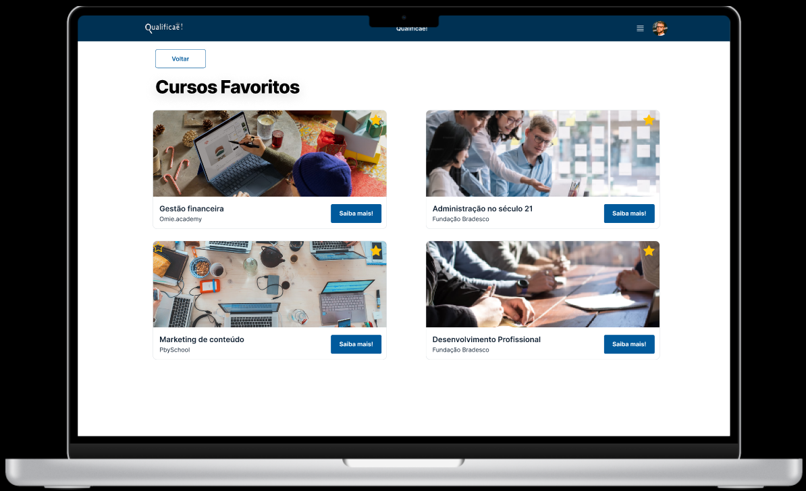
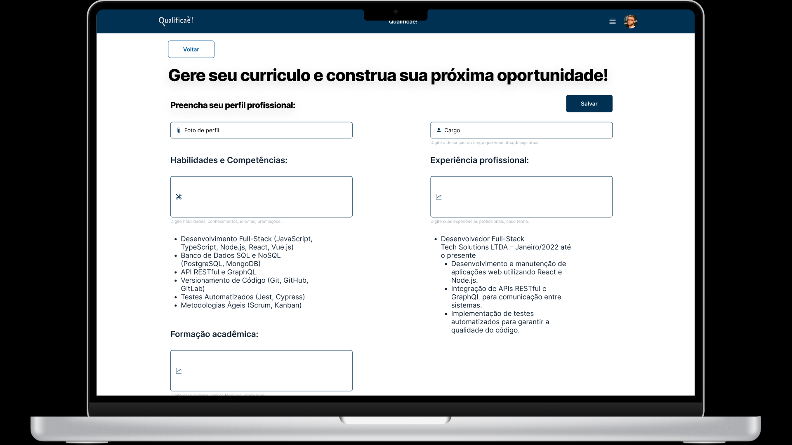

# Arquitetura da solução

<span style="color:red">Pré-requisitos: <a href="05-Projeto-interface.md"> Projeto de interface</a></span>

Definição de como o software é estruturado em termos dos componentes que fazem parte da solução e do ambiente de hospedagem da aplicação.


## Funcionalidades

Esta seção apresenta as funcionalidades da solução.

##### Funcionalidade 1 - Cadastro de usuário

Permite a inclusão dos dados do usuário no sistema

* **Estrutura de dados:** [Usuarios](#estrutura-de-dados---usuarios)
* **Instruções de acesso:**

  * Abra o site no menu principal e escolha a opção do ícone de perfil;
  * Em seguida, escolha a opção criar conta;
  * Abra o formulário e preencha com seus dados.

* **Tela da funcionalidade**:


##### Funcionalidade 2 - Login do usuário

Permite que o usuário acesse sua conta

* **Estrutura de dados:** [Usuarios](#estrutura-de-dados---usuarios)
* **Instruções de acesso:**

  * Abra o site no menu principal e escolha a opção do ícone de perfil;
  * Em seguida, escolha a opção login;
  * Com seus dados já cadastrados faça login no site.

* **Tela da funcionalidade**:


##### Funcionalidade 3 - Exibir os cursos favoritados

Mostra na tela os cursos que foram adicionados aos favoritos do usuário

* **Estrutura de dados:** [Usuarios](#estrutura-de-dados---usuarios) e [Cursos](#estrutura-de-dados---cursos)
* **Instruções de acesso:**

  * Abra o site e efetue o login;
  * Acesse o menu principal e escolha a opção do ícone de favoritos;
  * Os cursos que estiverem favoritos aparecerão.


* **Tela da funcionalidade**:



##### Funcionalidade 4 - Favoritar cursos

Opção para o usuário adicionar algum curso aos favoritos

* **Estrutura de dados:** [Usuarios](#estrutura-de-dados---usuarios) e [Cursos](#estrutura-de-dados---cursos)
* **Instruções de acesso:**

  * Abra o site e efetue o login;
  * Acesse o menu principal e escolha a opção de curso;
  * Escolha o curso desejado e clique na bandeira de favoritar.


* **Tela da funcionalidade**:


##### Funcionalidade 5 - Filtrar cursos por categorias

Navegue pelos cursos mudando as categorias separadas por áreas de estudos

* **Estrutura de dados:** [Cursos](#estrutura-de-dados---cursos)
* **Instruções de acesso:**

  * Abra o site;
  * Acesse o menu principal e escolha a opção de cursos;
  * Escolha a categoria desejada que os cursos disponíveis vão ser exibidos.

* **Tela da funcionalidade**:


##### Funcionalidade 6 - Pesquisar cursos por nome

Escolha uma categoria e pesquise pelo nome do curso desejado

* **Estrutura de dados:** [Cursos](#estrutura-de-dados---cursos)
* **Instruções de acesso:**

  * Abra o site;
  * Acesse o menu principal e escolha a opção de cursos;
  * Escolha a categoria desejada.
  * Na barra de pesquisa procure pelo nome do curso.

* **Tela da funcionalidade**:


##### Funcionalidade 7 - Avaliar o site

Deixe sua avalição e comentário sobre o site

* **Estrutura de dados:** [Cursos](#estrutura-de-dados---avaliacao)
* **Instruções de acesso:**

  * Abra o site;
  * Na página home procure o ícone de avaliação;
  * Ao abrir faça a avaliação do site.

* **Tela da funcionalidade**:


##### Funcionalidade 8 - Cadastrar as informações do currículo

Completar o cadastro inicial para ter os dados para completar o currículo

* **Estrutura de dados:** [Usuarios](#estrutura-de-dados---usuarios)
* **Instruções de acesso:**

  * Abra o site e efetue o login;
  * Acesse o menu principal e escolha a opção de currículos;
  * Preencha as informações referente ao seu currículo.
  * Salve as informações.

* **Tela da funcionalidade**:




##### Funcionalidade 9 - Gerar currículo

Baixar o pdf do currículo para poder usá-lo

* **Estrutura de dados:** [Usuarios](#estrutura-de-dados---usuarios)
* **Instruções de acesso:**

  * Abra o site e efetue o login;
  * Acesse o menu principal e escolha a opção de currículos;
  * Com as informações já cadastradas no perfil.
  * Escolha a opção gerar currículo e o pdf será baixado.

* **Tela da funcionalidade**:


##### Funcionalidade 10 - Forúm de mensagens

Permiete os usuário a fazer comentário no site interagindo com outros usuários

* **Estrutura de dados:** [Usuarios](#estrutura-de-dados---forum)
* **Instruções de acesso:**

  * Abra o site e efetue o login;
  * Acesse o menu principal e escolha a opção de fórum;
  * Escreva seu comentário desejado.

* **Tela da funcionalidade**:


##### Funcionalidade 11 - Like e dislike fórum de mensagem

Permite que o usuário interaja com gostei ou não gostei nas mensagens do usuários

* **Estrutura de dados:** [Usuarios](#estrutura-de-dados---forum)
* **Instruções de acesso:**

  * Abra o site e efetue o login;
  * Acesse o menu principal e escolha a opção de fórum;
  * Visualize as mensagens publicadas.
  * No botão de like ou dislike interaja com elas.


* **Tela da funcionalidade**:


### Estruturas de dados

Descrição das estruturas de dados utilizadas na solução com exemplos no formato JSON.Info.

##### Estrutura de dados - usuarios

Registro dos usuários do sistema utilizados para login e para o perfil do sistema.

```json
  {
    "id": 1,
    "nome": "Leanne Graham",
    "cidade": "Belo Horizonte",
    "categoria": "amigos",
    "email": "Sincere@april.biz",
    "telefone": "1-770-736-8031",
    "website": "hildegard.org"
  }
  
```

##### Estrutura de dados - cursos  

Registro de cursos disponiveis por categoria no sistema

```json
  {
    id: "eed55b91-45be-4f2c-81bc-7686135503f9",
    email: "admin@abc.com",
    id: "eed55b91-45be-4f2c-81bc-7686135503f9",
    login: "admin",
    nome: "Administrador do Sistema",
    senha: "123"
  }
```

##### Estrutura de dados - forum  

Registro de mensagens e interações entre os usuários

```json
  {
    id: "eed55b91-45be-4f2c-81bc-7686135503f9",
    email: "admin@abc.com",
    id: "eed55b91-45be-4f2c-81bc-7686135503f9",
    login: "admin",
    nome: "Administrador do Sistema",
    senha: "123"
  }
```

##### Estrutura de dados - avaliacao  

Registro de avaliações do site feitas pelos os usuários

```json
  {
    id: "eed55b91-45be-4f2c-81bc-7686135503f9",
    email: "admin@abc.com",
    id: "eed55b91-45be-4f2c-81bc-7686135503f9",
    login: "admin",
    nome: "Administrador do Sistema",
    senha: "123"
  }
```


### Módulos e APIs

Esta seção apresenta os módulos e APIs utilizados na solução.

**Images**:

* Shutterstock - [Shutterstock](https://www.shutterstock.com/pt/) 

**Fonts:**

* Fonts Google - [Fonts Google](https://fonts.google.com/specimen/Inter)

**Scripts:**

* jQuery - [http://www.jquery.com/](http://www.jquery.com/) 
* Bootstrap 4 - [http://getbootstrap.com/](http://getbootstrap.com/)

**API:**

* Pdfshift - [Pdfshift](https://pdfshift.io/)


## Hospedagem

Utilizamos a ferramenta Render, que oferece uma opção gratuita da API em Node.js com integração direta com o repositório no Github.

